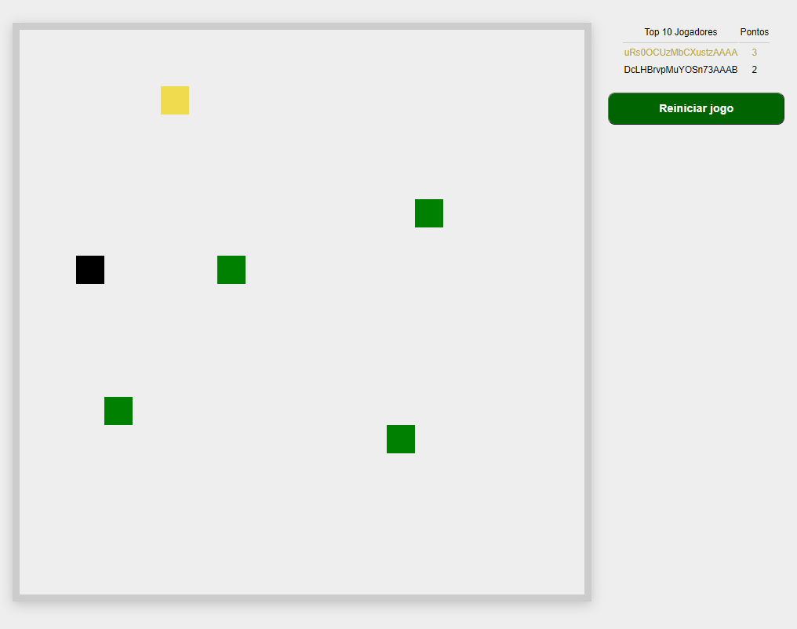

  

  <a href="#-projeto">Projeto</a>&nbsp;&nbsp;&nbsp;|&nbsp;&nbsp;&nbsp; 
  <a href="#-como-rodar">Como rodar</a>&nbsp;&nbsp;&nbsp;|&nbsp;&nbsp;&nbsp;
  <a href="#-como-contribuir">Como contribuir</a>&nbsp;&nbsp;&nbsp;
 

 

# Snake Game

  

## 🚀 Tecnologias

Esse projeto foi desenvolvido com as seguintes tecnologias:

- [Yarn](https://yarnpkg.com/) - 1.22.4
- [Npm](https://www.npmjs.com/) - 6.14.5
- [CSS3](https://developer.mozilla.org/pt-BR/docs/Web/CSS)
- [HTML5](https://developer.mozilla.org/pt-BR/docs/Web/HTML/HTML5)
- [JavaScript](https://developer.mozilla.org/pt-BR/docs/Web/JavaScript)

## 💻 Projeto

Projeto com o jogo da cobrinha(snake game).

Esse projeto foi inspirado no video do canal [Filipe Deschamps](https://www.youtube.com/watch?v=0sTfIZvjYJk&list=PLMdYygf53DP5SVQQrkKCVWDS0TwYLVitL).

Codigo original [Github](https://github.com/filipedeschamps/meu-primeiro-jogo-multiplayer)

Execute o projeto pelo [Gitbod](http://gitpod.io/#https://github.com/jamangueira7/js-jogo-multiplayer)

## 🚀 Como Rodar

- Clone o projeto.
- yarn install.
- yarn start.
- acesse http://localhost:3000/

## 🤔 Como contribuir

- Faça um fork desse repositório;
- Cria uma branch com a sua feature: `git checkout -b minha-feature`;
- Faça commit das suas alterações: `git commit -m 'feat: Minha nova feature'`;
- Faça push para a sua branch: `git push origin minha-feature`.

Depois que o merge da sua pull request for feito, você pode deletar a sua branch.

